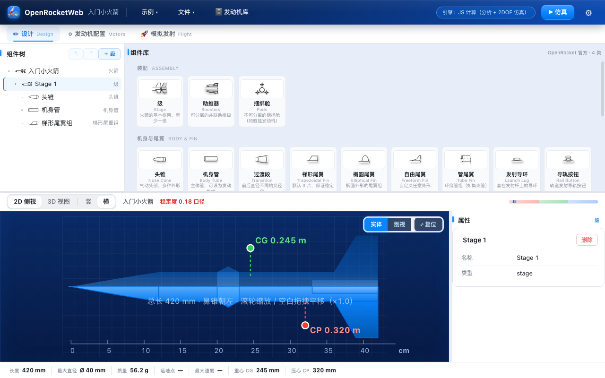
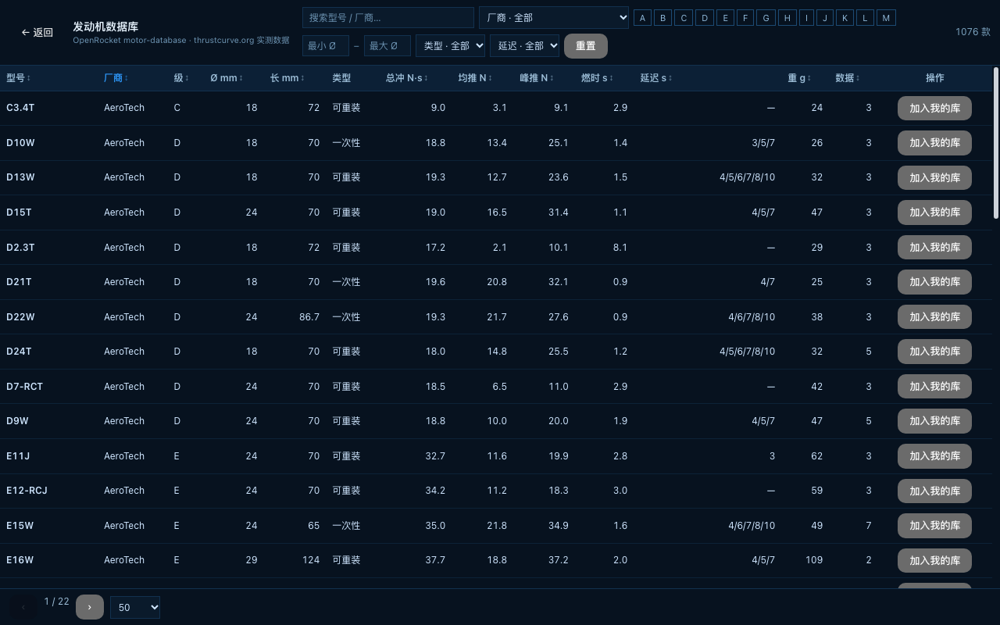

# OpenRocket Web

[OpenRocket](https://github.com/openrocket/openrocket)（Java 开源火箭模拟器）的 **Vue3 + TypeScript 纯前端 Web 重构版**。无需安装、无需后端、无需本地 Java，浏览器打开即用。

**在线预览**：https://yihuanfeng.github.io/openrocket-web/ （GitHub Pages 自动部署）





## 功能

- **2D / 3D 火箭视图**：真实长径比渲染，横竖两种摆放；3D 支持等距/正视/侧视/顶视视角与剖视/实体切换，部件带程序化材质纹理
- **组件设计**：组件树（增删改、拖拽排序）、组件库（22 类官方组件全覆盖）、属性面板（轴向、半径、材质、颜色）
- **尾翼外形**：梯形 / 椭圆 / 自由 / 管翼四种外形，2D 与 3D 按各自几何渲染（不再千篇一律）
- **并联结构**：助推器（Boosters）与捆绑舱（Pods）并联级布局，2D/3D 并排渲染
- **发动机配置**：26 款 Estes 内置发动机 + `.eng` 文件导入；多发动机对比
- **仿真**：飞行仿真（2DOF），输出高度/速度/加速度曲线、最大速度/高度等
- **示例**：6 个内置入门示例 + 16 个官方 OpenRocket 示例（带缩略图，一键加载）
- **稳定性分析**：重心（CG）/ 压心（CP）实时计算与标记，tooltip 解释物理含义
- **设置**：上下/左右主布局切换、单位切换（mm/cm/m）、面板宽度拖拽

## 快速开始

需要 Node.js 18+。在 `openrocket-web/` 目录下：

```bash
npm ci            # 安装依赖
npm run dev       # 开发模式（热更新，默认 http://localhost:5173）
npm run build     # 类型检查 + 生产构建（产物 dist/）
npm run preview   # 预览生产构建（默认 http://localhost:4173/）
npm run gen:thumbs # 重新生成示例缩略图（修改示例/几何后运行）
```

## 技术栈

- Vue 3 + TypeScript + Vite
- 几何引擎：自研 `geometry.ts`（轴向语义对齐 OpenRocket 官方：TOP/AFTER/MIDDLE/BOTTOM）
- 仿真：JS 引擎为主；WASM 引擎为备选（自动降级）
- 资源：官方示例 .ork、组件库 .orc、发动机规格均取自 OpenRocket 开源仓库

## 部署（GitHub Pages）

仓库已配置自动部署 workflow（`.github/workflows/deploy.yml`，构建产物走相对路径，支持子路径部署）：

1. 将仓库推送到 GitHub
2. 仓库 Settings → Pages → Source 选择 **GitHub Actions**
3. push 到 main 后自动构建发布

## 目录结构

```
├── openrocket-web/          # 前端主项目
│   ├── src/lib/              # 核心逻辑（几何/解析/发动机/仿真）
│   ├── src/components/       # UI 组件（视图/面板）
│   └── public/ork-assets/    # 官方素材（示例 .ork、缩略图、组件库、wasm）
├── docs/                     # 项目文档（规划、技术验证、素材清单）
└── .github/workflows/        # CI 部署配置
```

## 相关文档

- [`docs/OpenRocket_Vue_WASM_重构规划.md`](docs/OpenRocket_Vue_WASM_重构规划.md) — 重构总体规划
- [`docs/阶段0技术验证报告_WASM可行性.md`](docs/阶段0技术验证报告_WASM可行性.md) — WASM 可行性验证
- [`docs/OpenRocket_官方组件与素材清单.md`](docs/OpenRocket_官方组件与素材清单.md) — 官方组件与素材盘点
- [`agents.md`](agents.md) — AI 代理协作说明（架构/命令/约定/验证方式）

## 许可

本项目的官方数据与素材（示例、组件规格、发动机规格）来自 [OpenRocket](https://github.com/openrocket/openrocket)（GPL-3.0），版权归原作者所有。本项目代码基于 OpenRocket 设计语义独立实现。
